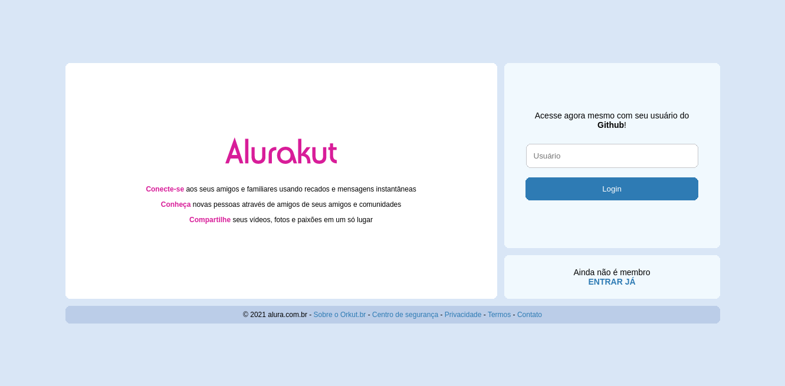
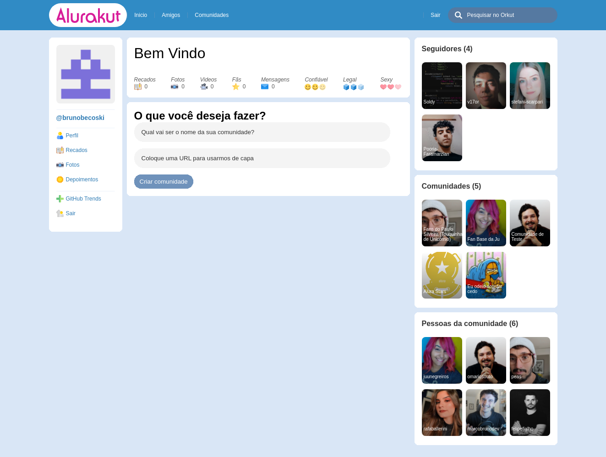

<p align="center">
  
</p>

</br >

<p align="center">
  <a href="#-sobre">Sobre</a>&nbsp;&nbsp;&nbsp;|&nbsp;&nbsp;&nbsp;
  <a href="#-tecnologias">Tecnologias</a>&nbsp;&nbsp;&nbsp;|&nbsp;&nbsp;&nbsp;
  <a href="#-projeto">Projeto</a>&nbsp;&nbsp;&nbsp;|&nbsp;&nbsp;&nbsp;
  <a href="#-como-executar">Como executar</a>
</p> 

</br>

<div align="center">
  
  
</div>

</br>

## 📖 Sobre

Projeto desenvolvido durante a 3ª Imersão React da Alura.

</br>

## ⚙ Tecnologias

Esse projeto foi desenvolvido com as seguintes tecnologias:

- [Next.js](https://nextjs.org)
- [Styled Componentss](https://styled-components.com)
- [DatoCMS](https://www.datocms.com)

</br>

## 💻 Projeto

O Alurakut é uma rede social inspirada no Orkut.

</br>

## 🚀 Como executar

- Clone o repositório
```
git clone https://github.com/BrunoBecoski/alurakut-ImersaoReact-ALURA.git
```
- Instale as dependências
```
yarn
```
- Inicie o servidor
``` 
yarn dev
```
- Acesse no seu navegador
```
http://localhost:3000
```

